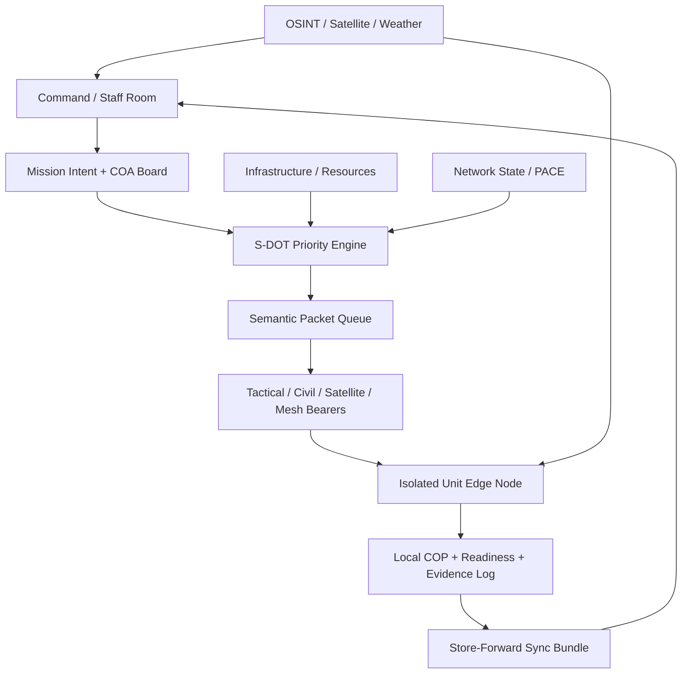

# S-DOT Command / Staff Synthesis

- Created: 2026-07-04 KST
- User problem name: `S-DOT: Semantic Data On Tactical-network`
- Related active workstream: `D4D_지휘참모추가` demo development
- Conflict boundary: this document does **not** edit demo app files or dataset generator files currently being modified by that session.

## Executive Conclusion

The user direction is substantially right, but it should be reframed from:

> "통신이 끊겨도 지휘부가 부대를 계속 파악하고 명령한다"

to:

> "통신이 끊겨도 지휘 의도, 최소 상황도, 자원 상태, 예측 불확실성, 재연결 후 감사가 유지된다"

This matters because in DDIL/disconnected environments, the headquarters cannot assume real-time control. The realistic product is not remote-control of isolated units. It is **mission continuity and decision support under uncertainty**.

## Naming Feedback

`S-DOT` is a strong name for the hackathon, but there is an important caveat.

`SDoT` is already used by infodas for `Secure Domain Transition`, including tactical edge cross-domain products. Therefore:

- It is okay to use `S-DOT` as an internal project name.
- In presentations, define it explicitly as `Semantic Data On Tactical-network`.
- Avoid implying this is an existing standard.
- Safer display name:
  - `S-DOT Mission Continuity COP`
  - `S-DOT: Semantic Data on Tactical Networks`
  - `S-DOT Command Continuity Layer`

## Assessment Of The User's 8 Points

| User point | Assessment | Recommended refinement |
|---|---|---|
| 1. Main problem is S-DOT semantic transmission | Correct | Make S-DOT an application-layer decision-support pattern, not a replacement tactical data link. |
| 2. Build COP under communication denial, connect to command judgment | Correct and strong | Use `Mission Continuity COP`, not just a map dashboard. |
| 3. Three components: unit, infrastructure/resources, command/staff | Correct | Add a fourth hidden layer: `Network / Bearer / PACE state`, because comms state drives everything. |
| 4. Units follow command intent but tactically adapt | Correct | Model this as `Commander Intent + Local Decision Rules + C2 Mode`. |
| 5. HQ wants imagery/unit/comms info but may be cut off | Correct | Show `confirmed`, `predicted`, `stale`, and `unknown` separately. Do not show predictions as facts. |
| 6. Send compressed priorities/orders; predict route/progress during blackout | Mostly correct | "Predict" must mean probabilistic branch scenarios, not exact tracking. Add uncertainty envelope and confidence decay. |
| 7. Decide resources/routes/nearby support options | Correct with safety limits | Use synthetic unit/resource data. Use public infrastructure only as context. Avoid real military deployment data. |
| 8. Korea dense infrastructure might support continuity | Theoretically plausible, operationally conditional | Treat civilian infra as opportunistic bearers, not guaranteed military assets. Legal/technical/security controls are essential. |

## Core Concept

S-DOT should transmit **mission meaning**, not raw data.

The system should answer:

1. What is the commander's intent?
2. What does the isolated unit know locally?
3. What does HQ know, and how stale is it?
4. What is predicted but uncertain?
5. Which messages/resources matter most under the current network condition?
6. What should be synced first when contact briefly returns?

## Recommended Architecture



## Four Planes

### 1. Unit Plane

Represents isolated or intermittently connected field units.

Required objects:

- `UnitNode`
- `MissionIntent`
- `LocalCOP`
- `ReadinessState`
- `PredictedState`
- `SyncBundle`
- `RejoinAudit`

Core state:

```json
{
  "unit_id": "River-1",
  "comm_state": "intermittent",
  "c2_mode": "delegated",
  "last_confirmed_at": "2026-07-04T09:35:00Z",
  "local_cop_version": "lcop_river_1_018",
  "power_remaining_pct": 42,
  "critical_supplies_state": "amber",
  "predicted_position": {
    "lat": 37.31,
    "lon": 125.64,
    "uncertainty_radius_m": 1800,
    "confidence": 0.58
  }
}
```

### 2. Infrastructure / Resource Plane

Represents support and sustainment options.

Use public data for:

- roads, bridges, ports, hospitals, shelters, power infrastructure, terrain, weather
- Korea-specific public infrastructure layers when available

Use synthetic data for:

- military units
- support units
- military supplies
- unit locations
- operational resource allocation

Required objects:

- `ResourceNode`
- `SupportOption`
- `SupportRoute`
- `CivilCommsAsset`
- `PowerAsset`
- `MedicalSupportNode`

### 3. Command / Staff Plane

Represents HQ / staff decision process.

Required objects:

- `StaffDecision`
- `COACard`
- `IntentUpdate`
- `PriorityPolicy`
- `RiskPosture`
- `ActionLog`

Key principle:

Staff do not need every raw observation. They need enough structured meaning to choose:

- maintain intent
- change priority
- allocate support
- request confirmation
- wait for rejoin
- switch C2 mode

### 4. Network / Bearer Plane

This should be explicit, not hidden.

Required objects:

- `NetworkState`
- `Bearer`
- `PacePlan`
- `CommsWindow`
- `PayloadTier`
- `DeliveryReceipt`

Example:

```json
{
  "pace_plan": {
    "primary": "tactical_ip",
    "alternate": "satellite_terminal",
    "contingency": "civil_lte_or_ps_lte",
    "emergency": "lo_ra_store_forward_or_physical_courier"
  },
  "switch_triggers": [
    "packet_loss_pct > 30",
    "no_contact_minutes > 15",
    "power_remaining_pct < 25",
    "hostile_routed_network_state == true"
  ]
}
```

## S-DOT Message Types

| Message type | From | To | Purpose | Payload tier |
|---|---|---|---|---|
| `IntentUpdate` | HQ | Unit | mission intent, constraints, priorities | very small / high priority |
| `SituationDelta` | Unit/HQ | Both | changed facts since last sync | compact delta |
| `ReadinessHeartbeat` | Unit | HQ | power, supplies, health, comm status | tiny heartbeat |
| `SupportRequest` | Unit | HQ | resource need without raw detail | compact structured request |
| `ResourceOffer` | HQ | Unit | nearby support option and route class | compact |
| `RouteRiskUpdate` | HQ/Unit | Both | route degradation, bridge/road/port issue | compact |
| `EvidenceDigest` | Unit | HQ | evidence refs, confidence, provenance | compact digest |
| `RejoinAudit` | Unit/HQ | Both | what happened while disconnected | delayed bundle |
| `PolicyUpdate` | HQ | Unit | C2 mode, sync rule, priority weights | very small |

## Payload Tiers

| Tier | When | Example |
|---|---|---|
| `full` | healthy network | map tile, evidence, imagery thumbnail, full track |
| `delta` | degraded network | only changed fields, confidence, timestamp |
| `alert_card` | low bandwidth | one semantic event card |
| `heartbeat` | severe DDIL | unit id, state, time, priority flag |
| `store_forward` | disconnected | queue signed graph delta for later sync |
| `offline_local` | no link | local COP only, no transmission |

## Priority Engine

Do not prioritize by data size alone. Prioritize by mission value per byte and per watt.

```text
priority =
  0.24 * mission_relevance
  + 0.18 * urgency
  + 0.16 * decision_impact
  + 0.14 * confidence
  + 0.10 * freshness
  + 0.08 * support_dependency
  + 0.06 * network_efficiency
  + 0.04 * provenance_completeness
```

Transmission utility:

```text
utility_per_cost = priority / (bytes + retransmission_risk + power_cost)
```

This can be implemented as:

- simple weighted scoring for MVP;
- knapsack selection for a short contact window;
- later: robust optimization / simulation.

## C2 Mode Manager

The system should explicitly change C2 mode as network state changes.

| Network condition | C2 mode | System behavior |
|---|---|---|
| connected | centralized / collaborative | rich COP, full evidence, HQ updates |
| degraded | collaborative | semantic deltas, alert cards |
| intermittent | delegated | intent-based local execution, priority sync |
| isolated | local autonomous | local COP, sync queue, confidence decay |
| rejoined | review / reconcile | merge logs, compare predicted vs actual |

## Prediction Method

Point 6 is directionally correct, but should not be framed as exact tracking.

Use:

- last confirmed unit state
- mission intent
- known route/phase constraints
- terrain/weather constraints
- resource burn-down
- network silence duration
- local event probabilities

Output:

- predicted phase
- predicted area/envelope
- confidence decay
- branch scenarios
- stale-data warning

Example:

```json
{
  "unit_id": "River-1",
  "prediction_type": "branch_scenario",
  "branches": [
    {
      "branch": "continue_primary_route",
      "probability": 0.52,
      "expected_area": "grid_alpha_3",
      "uncertainty_radius_m": 1800,
      "risk": "amber"
    },
    {
      "branch": "hold_due_to_comms_loss",
      "probability": 0.31,
      "expected_area": "last_known_area",
      "risk": "yellow"
    },
    {
      "branch": "divert_to_support_node",
      "probability": 0.17,
      "expected_area": "support_route_b",
      "risk": "red"
    }
  ]
}
```

## Resource / Route Recommendation

Point 7 is strong, but it should be framed as **support option ranking**, not automated tactical deployment.

Inputs:

- unit readiness
- mission intent
- infrastructure availability
- route status
- weather
- comms state
- resource node capacity
- risk and time window

Output:

- support options
- why ranked
- constraints
- confidence
- what information is missing

Example:

```json
{
  "support_option_id": "support_bridge_7_to_river_1",
  "resource_type": "medical_or_power_support",
  "recommended": true,
  "reason": "closest support node with enough capacity and currently reachable via alternate route",
  "constraints": ["route risk medium", "network state intermittent", "weather degrading"],
  "requires_human_approval": true
}
```

## Korea Infrastructure Assumption Feedback

The idea is theoretically plausible, but should be expressed carefully.

### What Is Plausible

Korea has dense fixed/mobile infrastructure, public safety networks, commercial LTE/5G, fiber backhaul, Wi-Fi/AP density, and emergency telecom legal mechanisms. Public sources show:

- Korea has PS-LTE disaster safety network infrastructure for police, fire, coast guard and related disaster agencies.
- The Telecommunications Business Act has emergency provisions allowing government to require certain telecom handling or interconnection during wartime, disaster, or equivalent national emergency.
- KT has experience in disaster network concepts such as backpack LTE, drone LTE, and satellite LTE.

### What Is Not Safe To Assume

Do not claim:

- military can always use every private AP or commercial base station at will;
- civilian APs are secure tactical bearers;
- dense infrastructure remains powered, backhauled, authenticated, and uncompromised during war;
- more infrastructure automatically means more resilient C2.

### Correct Framing

Treat civilian / national infrastructure as an **opportunistic bearer catalog**:

```text
bearer = available communication path candidate
```

Each bearer needs:

- legal authorization status
- owner/operator
- power/backhaul state
- coverage
- trust level
- security level
- expected bandwidth
- risk of surveillance/compromise
- payload tier allowed

Example:

```json
{
  "bearer_id": "civil_lte_sector_042",
  "bearer_type": "civil_lte",
  "authorization": "emergency_authorized",
  "trust": "medium",
  "payload_allowed": ["public_alert", "low_sensitivity_status", "encrypted_semantic_packet"],
  "payload_blocked": ["raw_unit_location_history", "identity_sensitive_data"],
  "risk_flags": ["power_dependency", "civilian_congestion", "backhaul_unknown"]
}
```

## Palantir AIP / Foundry Fit

Palantir should be used for governed data/ontology/workflow, not for simulating edge isolation itself.

| Component | Use Palantir? | Reason |
|---|---|---|
| Ontology: UnitNode, ResourceNode, IntentPacket, NetworkState, SyncBundle | Yes | Foundry ontology is strong for objects, links, governance |
| Staff dashboard / operational app | Yes, if Workshop available | Operational users need object-centric UI |
| Actions: approve support option, issue intent update, mark event reviewed | Yes | Actions match staff workflow |
| Functions: priority scoring, resource ranking, trust scoring | Yes | Foundry Functions support operational logic |
| AIP Logic: evidence-grounded briefing | Yes | Good for summarizing ontology data with governance |
| Offline edge node simulation | No / local app | Foundry is not the isolated tactical edge |
| Network impairment simulator | Local app | Easier and safer in JS/Python mock simulator |
| Real tactical protocol | No | Out of scope and unsafe |

Palantir docs support this separation:

- Ontology objects/actions/functions for governed operational data.
- AIP Logic for LLM-backed functions over ontology data.
- OSDK / applications for external app development.

## What To Add To The Current Demo

Since `D4D_지휘참모추가` already added synthetic units/resources/S-DOT messages, the next analysis-driven additions should be:

1. `C2 Mode Manager`
   - connected, degraded, intermittent, isolated, rejoin.
2. `Confirmed vs Predicted`
   - show predicted state with confidence envelope, not as truth.
3. `Intent Card`
   - goal, constraints, priority weights, valid-until.
4. `PACE/Bearer Ladder`
   - tactical IP, satellite, civil LTE/PS-LTE, mesh/store-forward, physical courier.
5. `Resource Option Ranking`
   - support option score + reason + missing data.
6. `S-DOT Packet Inspector`
   - compare raw payload vs semantic packet.
7. `Rejoin Audit`
   - predicted vs actual after reconnection.

## Recommended Demo Story

1. HQ issues intent to `River-1`:
   - maintain observation of corridor
   - preserve power
   - report only high-priority changes under degraded link
2. `River-1` enters intermittent network state.
3. Raw map/evidence sync fails; S-DOT sends only `SituationDelta` and `ReadinessHeartbeat`.
4. Unit becomes isolated.
5. HQ shows:
   - last confirmed state
   - predicted branch scenarios
   - uncertainty envelope
   - readiness decay
6. Staff selects support option:
   - `Bridge-7 relay`
   - `Medic-2`
   - `civil LTE/PS-LTE bearer candidate`
7. A brief contact window opens.
8. Priority engine sends:
   - heartbeat
   - high-priority support request
   - evidence digest
   - local COP delta
9. Rejoin audit compares what HQ predicted with what the unit actually reports.

## Final Product Claim

S-DOT is not "a smaller message format."

It is a command-continuity layer that decides:

- what meaning matters,
- who needs it,
- when it expires,
- how much uncertainty it carries,
- which bearer can safely carry it,
- and what must be audited after reconnection.

That is the strongest way to connect semantic transmission, COP, staff decision-making, resources, and Korea's dense communication infrastructure assumption.

## Source Pointers

- DDIL research pack: `/Users/mollykim/projects/D4D/01_research/literature/t3_deep_research/ddil_isolated_tactical_research_20260704.md`
- Strategy / resource theory: `/Users/mollykim/projects/D4D/01_research/literature/t3_deep_research/strategy_tactics_resource_allocation_theory_20260704.md`
- Contemporary conflict lessons: `/Users/mollykim/projects/D4D/01_research/literature/t3_deep_research/contemporary_conflict_lessons_for_isolated_units_20260704.md`
- Current S-DOT proposal direction: `/Users/mollykim/projects/D4D/02_problem_statements/hypotheses/occupied_network_sentinel_proposal.md`
- infodas SDoT naming caveat: `https://www.infodas.com/en/solutions/sdot-cross-domain-solutions/sdot-comp-land-te/`
- IEEE Potentials tactical communications / semantic communications overview: `https://read.nxtbook.com/ieee/potentials/potentials_jan_feb_2024/new_horizons_in_tactical_comm.html`
- Software-Defined Multi-domain Tactical Networks: `https://clouds.cis.unimelb.edu.au/~rbuyya/papers/SDN-TacticalNetworks2021.pdf`
- Korean Telecommunications Business Act Article 66: `https://www.law.go.kr/LSW/lsLawLinkInfo.do?chrClsCd=010202&lsJoLnkSeq=1000085244`
- MOIS PS-LTE disaster safety network: `https://www.mois.go.kr/frt/sub/a06/b11/policyBriefingView/screen.do`
- Palantir Ontology overview: `https://palantir.com/docs/foundry/ontology/overview/`
- Palantir AIP Logic overview: `https://palantir.com/docs/foundry/logic/overview/`
