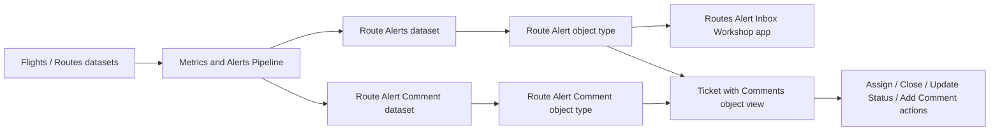

# Foundry Alert Workflow Deep Dive

Date: 2026-07-01  
Workspace: D4D hackathon Foundry tenant  
Mode: read-only walkthrough of installed `AIP Now Ontology` examples

## Purpose

이 문서는 Foundry에서 "데이터를 alert로 만들고, analyst가 인박스와 ticket 화면에서 처리하는 흐름"을 실제 예제 기준으로 정리합니다. D4D 해커톤에서는 이 패턴을 `Maritime Anomaly`, `Threat Alert`, `Supply Disruption`, `Drone Detection Alert` 같은 국방/안보 alert workflow로 바꿔 쓰면 됩니다.

## End-To-End Pattern Observed

실제 예제에서 확인한 흐름은 아래와 같습니다.

1. `Flights`와 `Routes` 같은 operational data가 존재합니다.
2. `Metrics and Alerts Pipeline`이 period metric, threshold, percent change, display value를 계산합니다.
3. Pipeline output이 `Route Alerts` dataset으로 만들어지고, 이것이 `[Example] Route Alert` object type에 매핑됩니다.
4. Workshop `Routes Alert Inbox`가 open alert 목록과 embedded route object view를 보여줍니다.
5. Workshop `Ticket with Comments | Route Alert`가 alert 상세, risk, metric change, similar alerts, comment input을 보여줍니다.
6. Ontology action types가 alert status/assignee/comment writeback을 통제합니다.

Mermaid view:

## Workshop: Route Alert Inbox

App: `[Example] Basic Inbox | Route Alert Inbox`  
Status: opened and interacted with safely

Observed behavior:

- Shows route alert list with `All Alerts` and `Assigned to Me`.
- `Filter` reveals actual alert rows and object context.
- Embedded object view shows selected `Route` properties and linked objects:
  - route id
  - average departure/arrival delay
  - origin/destination geopoints
  - flight count
  - departure airport
  - destination airport
  - linked flights
  - linked route alert

D4D translation:

- `Route` -> `Vessel`, `MissionRoute`, `Asset`, `ThreatActor`, `Organization`, or `Port`.
- `Route Alert` -> `MaritimeAnomaly`, `ThreatAlert`, `CredentialExposureAlert`, or `SupplyDisruptionAlert`.
- Embedded object view -> evidence/context pane for analyst triage.

## Workshop: Ticket With Comments

Object view: `[Example] Ticket with Comments | Route Alert`  
Status: opened safely; no comment submitted

Observed UI:

- Selected alert: `Cancellation Rate alert (High priority) for LAX -> LAS`
- Alert explanation:
  - current period metric
  - previous period metric
  - percent increase
  - risk score
  - similar alerts
- Object comments component:
  - search comments/actions
  - toggle comments/actions
  - refresh
  - comment input with `@` reference support
  - `Send` button disabled until input

D4D translation:

- This is the safest demo pattern for human-in-the-loop workflows.
- Show AI/metric-generated alert, then let analyst review evidence and add a comment or status update.
- For final demo, avoid submitting real sensitive data. Use sample or synthetic alert comments.

## Ontology Object: Route Alert

Object type: `[Example] Route Alert`  
Objects: 14  
Description: alerts generated from historical route performance, structured as an operational object type to demonstrate status and assignment patterns.

Key metadata:

- API name: `ExampleRouteAlert`
- Status: Example
- Visibility: Normal
- Index status: Indexed
- Edits: Enabled
- Properties: 23
- Action types: 4
- Link types: 3

### Route Alert Properties

| Property | Type / role observed | D4D use |
| --- | --- | --- |
| `id` | string | alert id |
| `title` | string | display title |
| `alert_type` | string | anomaly / exposure / disruption type |
| `assignee` | string, nullable in sample | analyst or team owner |
| `description` | string | short explanation |
| `description_markdown` | string | rich explanation / cited brief |
| `deviation_metric` | double | current deviation value |
| `previous_deviation_metric` | double | baseline/previous value |
| `metric_description` | string | human-readable metric meaning |
| `priority` | string | low/medium/high |
| `risk_level` | integer | numeric risk score |
| `route_id` | string | linked route/entity id |
| `status` | string | open/assigned/closed style workflow state |
| `alert_period_length` | integer | analysis window |
| `alert_period_start` | date | window start date |
| `flight_count` | long | supporting volume/count |
| `floor_threshold` | double | minimum threshold |
| `investigation_notes` | string, nullable in sample | analyst notes |
| `normalized_deviation_metric` | double | normalized current metric |
| `normalized_weighted_change_metric` | double | weighted change score |
| `percent_change` | double | raw percent change |
| `percent_change_display` | double | display-friendly percent change |
| `percent_change_threshold` | double | threshold used for alert generation |

### Route Alert Link Types

Observed link types:

- `[Example][Log] Update Route Alert Status`
- `[Example] Route`
- `[Example] Route Alert Comment`

D4D translation:

- Link alert to source entity: vessel, threat actor, organization, facility, route, mission, or asset.
- Link alert to comments, source evidence, and status-change logs.

## Ontology Object: Route Alert Comment

Object type: `[Example] Route Alert Comment`  
Objects: 0 in sample  
Properties: 7

Properties:

- `id`
- `title`
- `alert_id`
- `comment`
- `created_at`
- `created_by`
- `type`

Observed relationship:

- `Route Alert Comment` links back to `Route Alert`.
- It is created by the `Add Route Alert Comment` action type.

D4D translation:

- Use a separate comment/evidence-note object instead of stuffing analyst notes into alert text only.
- This gives an audit trail and supports timeline/comment history in Workshop.

## Action Types

### Assign Alert

Inputs:

- `Route Alert`
- `Assignee`

Rules:

- Modifies `[Example] Route Alert`
- Can update `Assignee` and `Status`

Dependents:

- Workshop: 1

D4D use:

- Assign `ThreatAlert` or `MaritimeAnomaly` to an analyst/team.

### Close Alert

Inputs:

- `Route Alert`

Rules:

- Modifies `[Example] Route Alert`
- Can update `Status`

D4D use:

- Mark false positive, resolved, or accepted risk.

### Update Route Alert Status

Inputs:

- `Route Alert`
- `Status`

Rules:

- Modifies `[Example] Route Alert`
- Can update `Status`

D4D use:

- Move alert through `New -> In Review -> Escalated -> Resolved`.

### Add Route Alert Comment

Inputs:

- `Route Alert`
- `Title`
- `Comment`
- `Type`

Rules:

- Creates `[Example] Route Alert Comment`
- Can set `Alert Id`, `Created At`, `Comment`, `Id`, `Title`, and related fields.

Dependents:

- Workshop: 1

D4D use:

- Add analyst note, evidence note, escalation rationale, or mitigation decision.

## Metrics And Alerts Pipeline

Pipeline: `[Example] Metrics and Alerts Pipeline`  
Status: opened in read-only mode

Observed message:

- `Viewing pipeline in read-only mode due to user permissions.`

Major pipeline groups:

- `Prepare Flight Data` - 3 contained nodes
- `Calculate Metrics For Periods` - 6 contained nodes
- `Calculate Change and Apply Thresholds` - 7 contained nodes
- `Prepare Display Values` - 4 contained nodes

Outputs:

- `Route Alert Comment`: 7/7 columns mapped
- `Route Alerts`: 23/23 columns mapped

Route Alerts dataset:

- 23 columns
- 14 rows
- Inputs: `Routes`, `Flights`
- Updated via `[Example] Metrics and Alerts Pipeline`

Route Alert Comment dataset:

- 7 columns
- 0 rows
- Updated via `[Example] Metrics and Alerts Pipeline`
- Serves as the writeback/comment object backing dataset.

## Route Alerts Dataset Schema

Observed in dataset `Columns` tab:

| Column | Type | Null rate observed |
| --- | --- | --- |
| `alert_period_length` | integer | 0% |
| `alert_period_start` | date | 0% |
| `status` | string | 0% |
| `investigation_notes` | string | 100% |
| `assignee` | string | 100% |
| `title` | string | 0% |
| `id` | string | 0% |
| `description_markdown` | string | 0% |
| `alert_type` | string | 0% |
| `metric_description` | string | 0% |
| `description` | string | 0% |
| `priority` | string | 0% |
| `percent_change_display` | double | 0% |
| `deviation_metric` | double | 0% |
| `previous_deviation_metric` | double | 0% |
| `risk_level` | integer | 0% |
| `normalized_weighted_change_metric` | double | 0% |
| `normalized_deviation_metric` | double | 0% |
| `percent_change` | double | 0% |
| `route_id` | string | 0% |
| `flight_count` | long | 0% |
| `percent_change_threshold` | double | 0% |
| `floor_threshold` | double | 0% |

## Flights Map / Linked Filter App

Object view: `[Example] Linked Filters with Map and Charts | Flights Map`  
Status: opened and toggled safely

Observed components:

- Global filter that responds to map and chart selections.
- Search input: `Search properties to add a filter`.
- Chart: `Route Flight Volume`.
- Map/Table switch.
- Map layers:
  - `Routes by Flight Volume`
  - `Runways by Length`
- Map rendered with Mapbox/OpenStreetMap attribution.

Table switch tested:

- Clicking `Table` switched the map area into tabular flight records.
- Table fields observed:
  - `Flight Number`
  - `Route Id`
  - `Departure`
  - `Arrival`
  - `Actual Elapsed Time`
  - `Scheduled Elapsed Time`
  - `Arr Delay`

D4D translation:

- Use the same map/table dual view for AIS, drone detection, sensor event, or OSINT incident data.
- Keep map for spatial awareness and table for precise inspection.
- Use global filter to connect chart/map/table selections.

## D4D Reference Architecture

Minimum useful D4D Foundry demo based on this pattern:

| Foundry pattern | D4D equivalent |
| --- | --- |
| `Route` | `Vessel`, `Port`, `MissionRoute`, `Organization`, `ThreatActor`, `Asset` |
| `Flight` | `AISPosition`, `SensorReading`, `OSINTReport`, `DroneDetection`, `MovementEvent` |
| `Route Alert` | `ThreatAlert`, `MaritimeAnomaly`, `CredentialExposureAlert`, `SupplyDisruptionAlert` |
| `Route Alert Comment` | `AnalystNote`, `EvidenceComment`, `EscalationNote` |
| `Metrics and Alerts Pipeline` | anomaly/risk scoring pipeline |
| `Routes Alert Inbox` | alert triage queue |
| `Ticket with Comments` | human review / decision support page |
| `Flights Map` | common operating picture map/table |

Suggested ontology for our own demo:

- `Source`
- `Entity`
- `Event`
- `Alert`
- `AlertComment`
- `AnalystDecision`

Suggested action types:

- `Assign Alert`
- `Update Alert Status`
- `Close / Resolve Alert`
- `Add Alert Comment`
- Optional: `Escalate Alert`
- Optional: `Generate Brief`

Suggested Workshop screens:

- Alert inbox
- Alert ticket/detail
- Map/table common operating picture
- Entity detail page
- Evidence/source list
- Timeline or Gantt-style event history

## What To Explore Next

1. AIP Logic example: classify/edit objects and generate alert explanations.
2. AIP Chatbot Studio or AIP Analyst: ask questions over ontology without exposing sensitive data.
3. Vertex Graph: show entity/alert/evidence network.
4. Workshop editing mode: inspect how inbox and ticket components are configured.
5. If explicitly approved, install one small Build with AIP example and document the install wizard.

