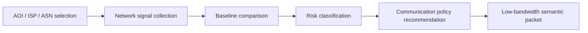

# Occupied Network Sentinel Methodology

- Created: 2026-07-04 KST
- Related proposal: `/Users/mollykim/projects/D4D/02_problem_statements/hypotheses/occupied_network_sentinel_proposal.md`
- Case anchor: Kherson / SkyNet-Khersontelecom forced rerouting through Miranda Media and Rostelecom
- Product question: **Is this connection safe enough to use, or is it connected but dangerous?**

## 0. Core Idea

Most communication-resilience tools ask:

> "Is the network online?"

This project asks a sharper question:

> "If the network is online, who controls the path, what can be observed or censored, and what communication mode should we allow?"

This distinction matters because Kherson showed that internet restoration can be deceptive. A blackout ended, but the restored route moved through Russian-controlled infrastructure. From a civilian or field operator perspective, "connected" did not equal "safe."

## 1. Method Overview



## 2. Inputs

### 2.1 AOI And Network Target

Define a monitored target as:

```json
{
  "aoi_id": "kherson",
  "city": "Kherson",
  "country": "UA",
  "asns": ["AS47598", "AS49168"],
  "known_hostile_or_high_risk_asns": ["AS201776"],
  "known_hostile_or_high_risk_labels": ["Miranda Media", "Rostelecom", "Russian-controlled transit"],
  "trusted_baseline_jurisdictions": ["UA", "PL", "DE", "NL", "US"],
  "sensitive_use_cases": ["medical", "journalist_evidence", "command_status", "civil_registry"]
}
```

Kherson seed:

- SkyNet / Khersontelecom: `AS47598`
- Brok-X: `AS49168`
- Miranda Media: `AS201776`

### 2.2 Data Signals

| Signal | Source | What it tells us |
|---|---|---|
| BGP state | RIPEstat BGP State, RIPE RIS | Which AS path currently reaches a prefix/ASN |
| BGP updates/history | RIPEstat routing history, RIS Live/raw | Whether upstream/origin/path changed abnormally |
| Active reachability | RIPE Atlas ping/traceroute/DNS/TLS | Whether the network can actually be reached from probes |
| Outage signal | IODA, Cloudflare Radar Outage Center | Whether a macroscopic outage or traffic drop occurred |
| Censorship/tampering | OONI API / OONI S3 data | Whether apps/sites show blocking or anomalies |
| Conflict context | GDELT, UCDP, ISW, ACLED when available | Whether outage/reroute coincides with occupation, strikes, power loss |
| Critical infrastructure context | OSM, local telecom/energy nodes | Who is affected: hospitals, rail stations, shelters, command posts |

## 3. Collection Method

### 3.1 BGP Path Collection

Use RIPEstat BGP State for a target ASN/prefix at multiple timestamps.

Official endpoint pattern:

```text
https://stat.ripe.net/data/bgp-state/data.json?resource=<ASN_OR_PREFIX>&timestamp=<ISO8601>
```

Example:

```text
https://stat.ripe.net/data/bgp-state/data.json?resource=AS47598&timestamp=2022-05-01T16:30
```

Store:

```json
{
  "timestamp": "2022-05-01T16:30:00Z",
  "resource": "AS47598",
  "observed_paths": [
    ["collector_peer", "...", "201776", "47598"]
  ],
  "origin_as": "47598",
  "upstream_as": "201776",
  "route_collectors": ["rrc00", "rrc04"]
}
```

### 3.2 Baseline Path

Build a "normal" baseline from a pre-crisis window.

For Kherson-style replay:

- baseline window: before 2022-04-30
- disruption window: 2022-04-30 to 2022-05-04
- later rerouting window: 2022-05-30 onward

Baseline features:

```json
{
  "normal_upstreams": ["UA transit ASNs"],
  "normal_path_country_sequence": ["UA", "..."],
  "normal_path_length_range": [3, 6],
  "normal_origin_as": "AS47598",
  "normal_rpki_state": "valid_or_unknown"
}
```

### 3.3 Active Reachability

Use RIPE Atlas public measurements when available, or create safe test measurements in a non-sensitive environment.

Recommended tests:

- ping to public target in the monitored prefix
- traceroute from nearby probes
- DNS lookup for a neutral domain
- TLS/HTTP only for public, non-sensitive endpoints

Do not probe active military systems, private addresses, or sensitive endpoints.

Output:

```json
{
  "reachability": "reachable",
  "packet_loss_pct": 12.5,
  "median_latency_ms": 118,
  "traceroute_as_path": ["probe_as", "...", "AS201776", "AS47598"],
  "confidence": 0.72
}
```

### 3.4 Censorship / Tampering

Use OONI for public measurement evidence.

Recommended tests to monitor:

- `web_connectivity`
- Signal / Telegram / WhatsApp reachability if available
- Psiphon / Tor / circumvention test metadata if available

Store only aggregate/anonymized evidence:

```json
{
  "country": "UA",
  "asn": "AS47598",
  "test_name": "web_connectivity",
  "anomaly_rate": 0.34,
  "tested_domains": 50,
  "confirmed_or_suspected_blocks": 12,
  "time_window": "2022-05-30/2022-06-07"
}
```

### 3.5 Outage / Traffic Drop

Use IODA or Cloudflare Radar outage feeds to establish whether a blackout happened before route change.

Key features:

```json
{
  "outage_detected": true,
  "start": "2022-04-30T16:10:00Z",
  "end": "2022-05-01T16:15:00Z",
  "signals": ["active_probing", "bgp", "darknet"],
  "severity": 0.84
}
```

### 3.6 Conflict Context

Correlate route changes with local situation:

- occupation or liberation event
- kinetic strike / power loss
- official or analyst reporting
- GDELT/UCDP/ACLED event near the AOI

This prevents overclaiming. A route change after a power-grid strike is different from a route change after occupation and ISP coercion.

## 4. Data Model

### 4.1 Observation Table

| Field | Meaning |
|---|---|
| `observation_id` | unique id |
| `aoi_id` | monitored area |
| `time` | observation timestamp |
| `source` | RIPEstat, RIPE Atlas, OONI, IODA, GDELT, etc. |
| `signal_type` | `bgp_path`, `reachability`, `censorship`, `outage`, `context_event` |
| `raw_ref` | local raw file or API URL |
| `value` | normalized observation payload |
| `confidence` | 0-1 confidence score |

### 4.2 Network Trust Event

```json
{
  "event_id": "nettrust_kherson_2022_05_01",
  "aoi_id": "kherson",
  "state": "hostile_routed",
  "severity": "critical",
  "time_start": "2022-05-01T16:15:00Z",
  "time_end": null,
  "affected_asns": ["AS47598"],
  "detected_changes": [
    "outage_then_restore",
    "upstream_changed",
    "path_contains_high_risk_asn",
    "jurisdiction_changed"
  ],
  "evidence_refs": [
    "ripe_bgp_state:AS47598:2022-05-01T16:30",
    "ioda:kherson:2022-04-30",
    "gdelt:kherson_reroute_articles",
    "kentik:kherson_rerouting_analysis"
  ],
  "operator_summary": "Network connectivity returned, but observed upstream/path now includes high-risk transit. Treat as connected but unsafe for sensitive traffic.",
  "recommended_policy": "public_only_or_encrypted_store_forward"
}
```

## 5. Scoring Logic

### 5.1 Feature Scores

| Feature | Score rule |
|---|---|
| `outage_score` | high if IODA/traffic/BGP visibility drops before restoration |
| `path_change_score` | high if upstream AS or AS path changes outside baseline |
| `hostile_as_score` | high if path includes high-risk AS/jurisdiction |
| `censorship_score` | high if OONI anomalies increase |
| `context_score` | high if local occupation/strike/power event exists |
| `reachability_score` | high if reachable; low if offline |
| `confidence_score` | based on number and independence of sources |

### 5.2 State Classifier

```text
if reachability_score < 0.2:
    state = offline
elif hostile_as_score >= 0.7 and path_change_score >= 0.5:
    state = hostile_routed
elif censorship_score >= 0.6:
    state = censored
elif outage_score >= 0.5 or packet_loss_pct high:
    state = degraded
elif confidence_score < 0.4:
    state = unknown
else:
    state = normal
```

### 5.3 Trust Score

```text
trust_score =
  100
  - 25 * outage_score
  - 30 * path_change_score
  - 40 * hostile_as_score
  - 25 * censorship_score
  - 15 * context_score
  + 10 * source_confidence
```

Clamp to `0..100`.

Interpretation:

| Score | Label |
|---:|---|
| 80-100 | safe enough |
| 60-79 | usable with caution |
| 40-59 | degraded / public only |
| 20-39 | hostile or censored |
| 0-19 | offline or unsafe |

## 6. Communication Policy Engine

| State | Allowed | Not allowed | Recommended mode |
|---|---|---|---|
| `normal` | public + routine operational traffic | highly sensitive raw identity data | normal sync |
| `degraded` | compressed status, evacuation bulletins, low-resolution evidence refs | bulk video/raw databases | semantic summary + store-forward |
| `hostile_routed` | public bulletins, already-public OSINT, signed non-sensitive alerts | identity lists, coordinates of vulnerable groups, journalist sources | trusted relay / satellite / deniable channel / store-forward |
| `censored` | fallback domain/protocol, bridge metadata, public alerts | assuming delivery of blocked apps | censorship-aware fallback |
| `unknown` | minimal public-only packet | sensitive content | wait for corroboration |
| `offline` | LoRa/FM/SMS mesh/physical courier | internet-dependent workflows | offline packet |

## 7. MVP Build Plan

### Week 1 / Hackathon Prep

1. Create historical Kherson replay dataset:
   - `AS47598`, `AS49168`, `AS201776`
   - timestamps around 2022-04-30, 2022-05-01, 2022-05-04, 2022-05-30
2. Pull RIPEstat BGP State for each timestamp.
3. Add static evidence references:
   - Kentik analysis
   - The Record / WIRED reports
   - Cloudflare/Kentik route context if available
4. Add OONI sample aggregate for Ukraine/Russia-side censorship baseline.
5. Create synthetic/derived trust events.

### MVP Demo

The first screen should show:

- AOI selector
- network trust state timeline
- route path comparison:
  - before: `UA upstream -> AS47598`
  - after: `Miranda/Rostelecom path -> AS47598`
- evidence drawer
- communication policy card
- low-bandwidth semantic packet preview

### Minimal Semantic Packet

```json
{
  "aoi": "kherson",
  "state": "hostile_routed",
  "trust_score": 24,
  "evidence_count": 4,
  "policy": "public_only_or_trusted_relay",
  "summary": "Internet reachable, but route path changed through high-risk transit after outage.",
  "expires_at": "2022-05-01T20:00:00Z"
}
```

This packet is small enough to send over degraded links while raw evidence waits for store-forward sync.

## 8. Evaluation

### Technical Metrics

- Was a path change detected?
- Was high-risk AS/jurisdiction exposure detected?
- How many independent evidence types support the state?
- How many bytes are saved by semantic packet vs raw evidence bundle?
- Does the system avoid overclaiming when evidence is weak?

### User-Facing Metrics

- Can a non-network expert understand whether the connection is safe?
- Does the system recommend an actionable communication policy?
- Can the analyst trace the recommendation back to evidence?

## 9. What Not To Build

- Do not build covert operational evasion tooling.
- Do not scrape or publish private messages.
- Do not recommend active probing of sensitive military endpoints.
- Do not provide real-time instructions for resistance groups.
- Do not use the system to identify individual users or device locations.

## 10. Sources Checked

- RIPEstat BGP State API: `https://stat.ripe.net/docs/data-api/api-endpoints/bgp-state`
- RIPE Atlas Measurements API: `https://atlas.ripe.net/docs/apis/rest-api-reference/measurements/`
- OONI API: `https://api.ooni.io/`
- OONI data access docs: `https://docs.ooni.org/data`
- IODA API: `https://api.ioda.inetintel.cc.gatech.edu/v2/`
- Kentik Kherson rerouting analysis: `https://www.kentik.com/blog/rerouting-of-kherson-follows-familiar-gameplan/`
- BGPKIT KhersonTelecom note: `https://bgpkit.com/blog/2022-05-01-khersontelecom-connectivity-change/`
