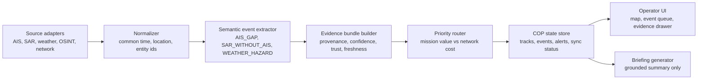

# Resilient Maritime COP over Denied Networks: Technical Design

- Version: v0.1
- Date: 2026-07-04 KST
- Track fit: T3 Battle Network, C2, Maritime Domain Awareness & Sustainment
- Data domain: maritime MDA, using T4-style AIS/SAR/weather/OSINT signals as inputs
- Current implementation mode: mock-data-first, API-ready

## 1. Product Definition

The system is a semantic Common Operational Picture (COP) for maritime operations under denied, degraded, intermittent, or limited-bandwidth network conditions.

It does not try to recreate a sensitive military tactical data link. It demonstrates an application-layer pattern:

1. collect raw observations from maritime and context sources;
2. convert observations into operationally meaningful events;
3. attach evidence, confidence, trust, and freshness;
4. decide which messages survive when bandwidth collapses;
5. update a commander-facing COP with traceable alerts.

The central claim is:

> When raw feeds cannot move, mission-relevant meaning can still move.

## 2. Scope Boundaries

### In Scope

- AIS-like vessel movement records
- SAR-like independent vessel detection
- weather hazard context
- OSINT incident context
- synthetic network degradation
- semantic event extraction
- trust and provenance-aware evidence bundles
- priority routing under constrained links
- local web demo with COP map, event queue, evidence drawer, and network mode comparison

### Out of Scope

- real Link-16, JREAP, or classified tactical protocol emulation
- RF jamming detection at the physical layer
- live military sensor integration
- legal attribution of illegal activity
- autonomous enforcement decisions

The demo is an analyst triage and decision-support prototype, not an operational targeting or enforcement system.

## 3. Workstream Coordination

The `D4D_리서치` session is collecting API accounts/keys and live data candidates. This implementation does not depend on live API keys and does not edit `.env`.

Live API adapters can later replace mock data at the source layer only.

```text
API/mock source -> normalized record -> semantic event -> priority packet -> COP update
```

Stable contract:

- source adapters may change;
- semantic events, priority packets, COP UI, and report should remain compatible.

## 4. Architecture



## 5. Core Data Objects

### 5.1 Vessel

```json
{
  "vessel_id": "vessel_haneul_77",
  "display_name": "Haneul-77",
  "masked_identifier": "MMSI-***-077",
  "type": "cargo",
  "identity_confidence": 0.81
}
```

Identifier rule:

- The mock dataset must not contain real personal or sensitive vessel operator data.
- Real live data should be hashed or masked before demo use unless the source explicitly permits redistribution.

### 5.2 Observation

An observation is a claim made by a source.

```json
{
  "observation_id": "obs_sar_001",
  "source": "synthetic_sar",
  "sensor_type": "SAR",
  "time": "2026-07-04T02:24:00Z",
  "location": {"lat": 37.41, "lon": 125.72},
  "claim": "vessel-sized object detected",
  "raw_ref": "mock://sar/scene_20260704_0224#det=1",
  "source_model": "xView3/DarkVesselNet-inspired SAR detection schema"
}
```

### 5.3 EvidenceBundle

An evidence bundle groups claims that support, weaken, or complicate a COP assertion.

Required fields:

- `bundle_id`
- `event_id`
- `modality_slots`
- `availability_mask`
- `evidence_refs`
- `confidence`
- `trust_score`
- `freshness_seconds`
- `review_status`

### 5.4 SemanticEvent

```json
{
  "event_id": "evt_ais_gap_001",
  "event_type": "AIS_GAP",
  "severity": "high",
  "priority": 0.88,
  "confidence": 0.74,
  "time": "2026-07-04T02:25:00Z",
  "location": {"lat": 37.39, "lon": 125.68, "area": "Yellow Sea AOI"},
  "summary": "Haneul-77 stopped AIS transmission near the monitored corridor.",
  "why_it_matters": "The gap overlaps degraded weather and a SAR detection without AIS match.",
  "recommended_action": "Preserve alert card, request independent confirmation, and monitor port-call correlation."
}
```

### 5.5 PriorityPacket

A priority packet is the actual low-bandwidth message that survives constrained links.

```json
{
  "packet_id": "pkt_001",
  "event_id": "evt_ais_gap_001",
  "network_mode": "semantic_summary",
  "payload_tier": "alert_card",
  "bytes_raw_estimate": 1480000,
  "bytes_semantic": 936,
  "transmission_decision": "send",
  "drop_reason": null
}
```

## 6. Event Types

| Event | Description | Detection logic in MVP |
| --- | --- | --- |
| `AIS_GAP` | AIS transmission gap or stale cooperative track | last AIS timestamp age exceeds scenario threshold |
| `SAR_WITHOUT_AIS` | independent SAR-like object has no AIS match | distance/time gate has no cooperative candidate |
| `WEATHER_HAZARD` | maritime weather degrades risk and sensor reliability | hazard severity from mock KMA/Copernicus-style source |
| `OSINT_INCIDENT` | external incident or advisory affects area | cited mock GDELT/official-advisory style event |
| `LOW_TRUST_REPORT` | report conflicts with physics or other sources | report location/source conflicts with trusted observation |
| `NETWORK_DEGRADED` | link state changes routing mode | bandwidth/latency/loss thresholds crossed |
| `PORT_CONTEXT` | port or chokepoint context raises mission relevance | event occurs near port/corridor/geofence |

## 7. Routing Algorithm

Priority score:

```text
priority =
  0.28 * mission_impact
  0.20 * urgency
  0.18 * confidence
  0.14 * trust
  0.10 * novelty
  0.10 * network_efficiency
```

Transmission decision:

| Network mode | Rule |
| --- | --- |
| `full_sync` | send all event details and selected evidence snippets |
| `delta_sync` | send changed tracks, high/medium alerts, compact evidence refs |
| `semantic_summary` | send only top-priority alert cards and object lists |
| `store_forward` | queue graph deltas; send short critical summary if possible |
| `local_only` | do not transmit; mark COP as stale and preserve local log |

## 8. Network Modes

| Mode | Bandwidth | Latency | Packet loss | Demo behavior |
| --- | ---: | ---: | ---: | --- |
| `full_sync` | 5000 kbps | 80 ms | 1% | raw thumbnails and full evidence available |
| `delta_sync` | 900 kbps | 220 ms | 4% | event deltas and compact refs |
| `semantic_summary` | 96 kbps | 950 ms | 14% | high-priority alert cards only |
| `store_forward` | 24 kbps | 1800 ms | 35% | queue most packets, send one critical summary |
| `local_only` | 0 kbps | n/a | 100% | local cache, no remote update |

## 9. Mock Dataset Strategy

The mock dataset is synthetic, but each field is modeled after a plausible open-data source type.

| Mock source | Real/API replacement later | Why included |
| --- | --- | --- |
| `mock_ais_tracks` | data.go.kr AIS, GFW, MarineTraffic, NOAA AIS | cooperative vessel behavior and AIS gaps |
| `mock_sar_detections` | Copernicus Sentinel-1, GFW SAR detections, xView3 | independent non-cooperative detection |
| `mock_weather_hazards` | KMA APIHub, Copernicus Marine, NOAA/NCEP | context and sensor reliability |
| `mock_osint_incidents` | GDELT, official advisories, ACLED | evidence narrative and risk context |
| `mock_network_states` | Cloudflare Radar, Ookla, RIPE Atlas, synthetic netem | T3 routing and degraded-network logic |

Each event includes:

- `evidence_refs`: source records used;
- `source_rationale`: why this source type is realistic;
- `mock_notice`: explicit statement that values are synthetic.

## 10. Frontend Demo Requirements

The demo must show the actual COP on first load.

Required views:

- map-like AOI panel with vessels, SAR detection, alert location, and network nodes;
- network mode selector;
- event/alert queue;
- evidence drawer for the selected alert;
- raw vs semantic bytes comparison;
- route decision list: sent, deferred, dropped;
- generated briefing that cites evidence IDs, not hidden model memory.

No login or API key should be required for this demo.

## 11. HTML Report Requirements

The report is for a non-technical reader. It should explain:

- what COP means;
- why sending raw data fails under denied networks;
- what semantic compression means, using an analogy;
- why AIS is not truth;
- why evidence bundles and trust scores matter;
- what the demo proves and does not prove;
- how live APIs can replace mock data later.

The report must not reveal API keys or credentials.

## 12. Verification Plan

Minimum checks:

1. Dataset JSON parses.
2. Every semantic event has at least one evidence ref.
3. Every priority packet references an existing event.
4. Demo loads dataset in browser.
5. Network mode changes visible routing behavior.
6. Evidence drawer updates when selecting alerts.
7. HTML report renders without external dependencies.

